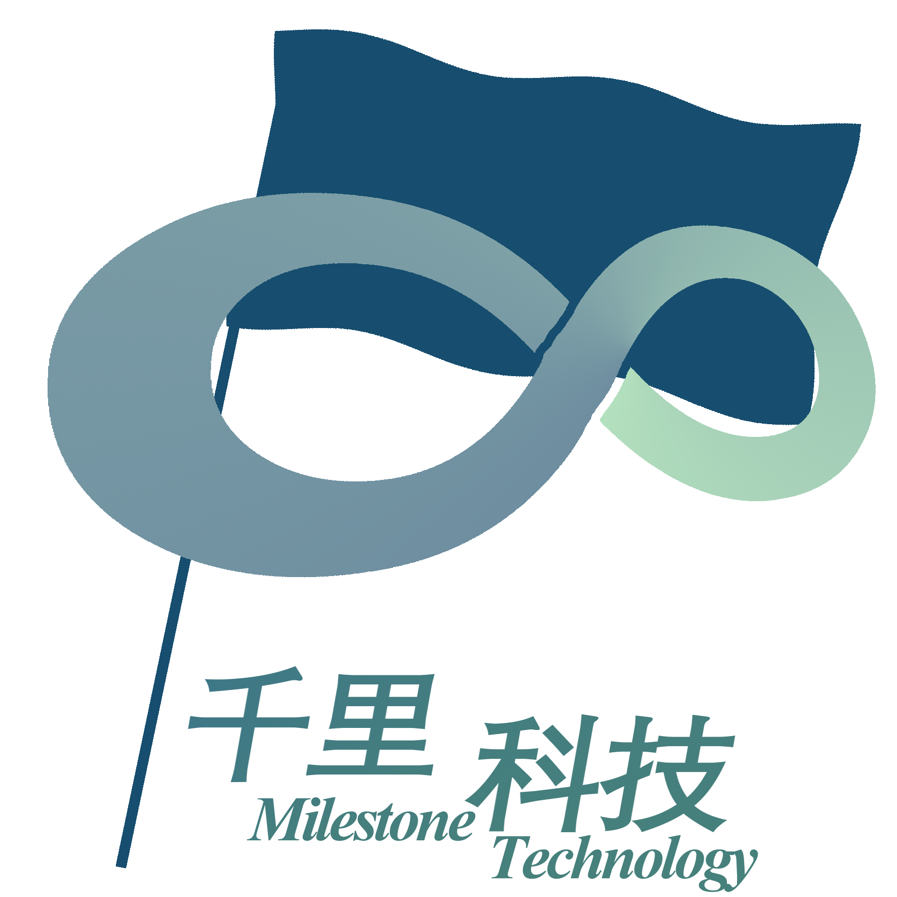

# 关于我们 · 千里科技

> 不积跬步，无以至千里。
> Every step counts. Every milestone matters.

---

## 一、我们是谁

千里科技，英文名 **Milestone Tech**。

前身是一个创立于校园项目环境下的战队组织。
现在，转型为github开源作者：**一个人，一套工具，一条规则，开辟一条路。**

我们不靠嗓门大，不靠情绪冲，不靠“就这一次”。
我们靠 SOP、靠模板、靠 CI、靠一块一块积木，把路实打实钉出来。

---

## 二、为什么叫“千里”

“千”这个字，对我们有四层意思。

**第一层：寻千。**
“众里寻他千百度。蓦然回首，那人却在，灯火阑珊处。”
——我们找过队友，找过路径，找过伯乐。最后发现，答案一直在自己身上。

**第二层：千里马。**
“世有伯乐，然后有千里马。千里马常有，而伯乐不常有。”
——没人看见，不等于你不是千里马。伯乐不常有，但千里马不需要伯乐才能跑。

**第三层：积千里。**
“不积跬步，无以至千里。”
“骐骥一跃，不能十步；驽马十驾，功在不舍。”
——每一步都算数。笑到最后，才是最好。

**第四层：千山孤。**
“千山鸟飞绝，万径人踪灭。”
——哪怕单兵作战，无依无靠，我们也能置之死地而后生。

合在一起，就是 **千里科技**。

---

## 三、我们做什么

第一件公开作品：**CI Blocks（CIB）**。

一个用搭积木方式生成 CI 脚本的开源工具。
让“配 CI”从填坑变成玩乐高。

它面向：

- 没时间查 YAML 语法的老将
- 被队友坑死的学校队长
- 想配 CI 但无从下手的主管

它的核心信念：

- **约定没有强制力。CI 规则才能。**
- **获奖是结果，不是特权。**
- **模型没有优势，不代表其他地方可以让路。**
- **规则不该只有懂技术的人才能立。**

CIB 不是终点，是千里的第一个“里”。

---

## 四、我们的定位

我们不是红色系莽子主角。
我们是少见的蓝色主角。

常见的蓝色动漫主角，都靠脑子、靠分析、靠预判赢。
红色系主角赢在爆发，蓝色系主角赢在终局。

千里重工的配色是**青蓝**。
冷静，不是热血；预判，不是反应；工程，不是蛮力；规则，不是情绪。

---

## 五、Logo

一个旗帜，插在无穷符号旁。

无穷变换成了一个脚印，代表我们的行动。

旗帜则代表着我们的里程碑。

不是空想无限，是在一个具体的项目、一次具体的交付、一块具体的积木上，把无限钉成现实。

---

## 六、铭文

> 众里寻他千百度。蓦然回首，那人却在，灯火阑珊处。
> 
> 世有伯乐，然后有千里马。千里马常有，而伯乐不常有。
> 
> 不积跬步，无以至千里。骐骥一跃，不能十步；驽马十驾，功在不舍。
> 
> 千山鸟飞绝，万径人踪灭。

不解释。
能读懂的人，就是下一个千里精神的传承者。

---

## 八、联系我们

- GitHub：[@ZiqianChen2005](https://github.com/ZiqianChen2005)
- 项目：CI Blocks（CIB）
- 状态：目前单兵作战，欢迎 issue、PR、以及下一个里程碑

---

**千里科技 / Milestone Tech**

*不积跬步，无以至千里。*